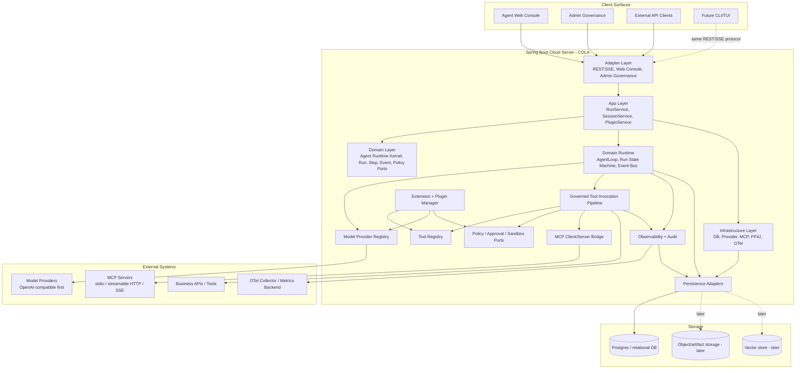

# Architecture Patterns: Java Cloud Agent Platform

**Project:** Pi Java Agent Platform  
**Domain:** Java cloud Agent runtime/platform system  
**Researched:** 2026-06-13  
**Overall confidence:** MEDIUM-HIGH

## Executive Recommendation

Architect the platform as a **COLA layered modular monolith first, distributed-capable later**: keep the Agent Runtime, registries, policy, persistence, API, and Web Console in one deployable Spring Boot Cloud Server for v1, but enforce explicit COLA boundaries so the execution plane can later split from the control plane. This gives the project a shippable Cloud Server quickly while avoiding a local CLI/TUI-shaped core.

The core should be a **framework-agnostic Java runtime kernel in the COLA Domain layer**. Domain owns Agent Loop semantics, Run/Session/Step state transitions, event emission, model/tool abstractions, Gateway/Port interfaces, and cancellation. Adapter owns HTTP/SSE APIs and Web GUI entry points. App owns use-case orchestration such as create run, cancel run, stream events, register tools, connect MCP, and load plugins. Infrastructure owns persistence, model provider adapters, MCP clients, PF4J/dynamic plugin mechanics, observability exporters, and Spring wiring. Dynamic plugins, MCP, and model providers should all adapt into the same internal extension contracts instead of each being special-cased inside the Agent Loop.

The most important architectural decision: **all tool execution must flow through one governed Tool Invocation Pipeline**: discovery → policy check → approval/sandbox hook → timeout/budget → execution → audit → event emission → result persistence. Java SPI tools, Spring Bean tools, dynamic plugin tools, and remote MCP tools must all become `ToolDescriptor + ToolExecutorBinding` records in the internal Tool Registry before an agent can use them. This prevents MCP/dynamic plugins from bypassing cloud safety and audit.

## Recommended COLA Architecture



### Architectural Style

Use **COLA (Adapter → App → Domain ← Infrastructure)**:

- **Adapter layer** exposes the platform through REST/SSE, Agent Web Console, Admin Governance, and future CLI/TUI adapters.
- **App layer** coordinates use cases such as create run, cancel run, stream events, register tools, connect MCP, load plugin, list tools, and approve gated calls.
- **Domain layer** defines stable Agent Runtime models, state machines, domain services, events, policies, and Gateway/Port interfaces. Domain has zero outward dependencies.
- **Infrastructure layer** implements Domain Gateway/Port interfaces for model providers, MCP transports, plugin loading, persistence, observability, security integration, and external systems.

Recommended package/module split:

| Module | COLA Layer | Role | May Depend On | Must Not Depend On |
|--------|------------|------|---------------|--------------------|
| `pi-agent-client` | Client contracts | DTOs, commands, queries, response envelopes, public API types | Java validation/serialization types | Domain internals, Infrastructure |
| `pi-agent-domain` | Domain | Agent Runtime, Run/Step/Event model, ToolDescriptor, Policy, Gateway/Port interfaces, domain services | Java/Jackson validation types only | Spring, DB, Vaadin, PF4J, MCP SDK, provider SDKs |
| `pi-agent-app` | App | Use cases: run/session/plugin/model/tool orchestration, command/query executors | domain, client | Web UI implementation, concrete DB/provider SDKs |
| `pi-agent-adapter-web` | Adapter | Spring Boot REST/SSE controllers, auth boundary, API mapping | app, client | Agent loop decisions, direct tool execution |
| `pi-agent-adapter-webui` | Adapter | Vaadin Agent Web Console and Admin Governance | app/client APIs | Runtime internals, direct DB access |
| `pi-agent-infrastructure-persistence` | Infrastructure | JDBC repositories, migrations, event store, read models | domain gateways, app ports | Agent loop decisions |
| `pi-agent-infrastructure-model-openai` | Infrastructure | OpenAI-compatible provider adapter | domain provider ports | Tool governance internals |
| `pi-agent-infrastructure-tools` | Infrastructure | Built-in safe tool implementations and tool adapters | domain tool ports | Web UI |
| `pi-agent-infrastructure-mcp` | Infrastructure | MCP client and optional MCP server exporter | domain tool/provider ports, MCP SDK | Direct runtime state mutation |
| `pi-agent-infrastructure-plugins` | Infrastructure | SPI, Spring Bean discovery, dynamic JAR/PF4J integration | domain/app extension ports | Direct DB writes, direct model calls |
| `pi-agent-infrastructure-observability` | Infrastructure | OTel spans, Micrometer metrics, audit event sinks | domain events | Tool/model business logic |

## Component Boundaries

| Component | COLA Layer | Responsibility | Communicates With | Boundary Rule |
|-----------|------------|----------------|-------------------|---------------|
| Agent Web Console / Admin Governance | Adapter | Agent Catalog, Chat/Run entry, timeline, approvals, governance views | App services through public APIs | No direct DB/runtime access |
| REST/SSE API Layer | Adapter | Authenticate/authorize requests; expose run/session/plugin/model endpoints; stream events | App Services | Controllers do not execute tools or call models directly |
| Application Services | App | Transaction/use-case orchestration: create run, cancel run, query history, manage plugins | Domain services/gateways, Infrastructure via ports | Contains workflow coordination, not agent reasoning |
| Agent Runtime Kernel | Domain | Agent Loop, step execution, state transitions, event emission, cancellation checks | Domain Gateway/Port interfaces | Framework-agnostic and embeddable; no Spring, HTTP, or DB classes |
| Model Provider Registry | Domain/App + Infrastructure adapters | Resolve provider/model config; normalize request/response/stream/tool-call formats | Provider adapters, Runtime | Provider-specific quirks stop at adapter boundary |
| Governed Tool Invocation Pipeline | Domain/App | Single path for validation, policy, approval, sandbox, timeout, retry, execution, audit | Tool Registry, Policy, Audit/Event Sink | No tool may bypass this pipeline |
| Tool Registry | Domain/App | Holds normalized tool descriptors, schemas, scopes, provenance, executor bindings | Plugins, MCP Bridge, Built-in tools, Runtime | Registry describes tools; it does not execute them directly |
| Policy / Approval / Sandbox Ports | Domain | Decide whether a tool/model/workspace action is allowed and under what constraints | Tool Pipeline, Admin/API for approvals | Policy is an extension point from v1, even if implementations are minimal |
| Plugin Manager | App + Infrastructure | Discover/load/start/stop SPI, Spring Bean, and dynamic JAR plugin contributions | Tool Registry, Model Registry, Policy Registry | Plugins contribute capabilities; they do not mutate runtime state directly |
| MCP Bridge | Infrastructure | Maintains MCP clients to remote/local MCP servers; discovers tools/resources/prompts; optionally exports platform tools as MCP server | Tool Registry, Tool Pipeline, MCP servers | MCP is an adapter, not the internal tool model |
| Session/Run Store | Infrastructure | Persist run/session/step/message/tool-call/event records | Runtime, Application Services, Admin queries | Append event records first; derive read models for UI |
| Observability + Audit | Infrastructure | Emit spans, metrics, logs, audit records for model calls, tool calls, agent steps, plugin lifecycle | Runtime events, Tool Pipeline, Spring Boot Actuator/OTel | Must not contain control-flow decisions except sampling/redaction |
| Workspace/Artifact Store | Infrastructure | Constrain files/artifacts/resources available to tools | Tool Pipeline, future memory/RAG | Treat as capability-scoped, not global filesystem |

## Data Flow

### 1. Run Creation and Streaming

Direction is explicit: **client → API → application service → runtime → events → API stream/client**.

1. Client calls `POST /api/runs` with `sessionId`, user message, model selection, allowed tool scopes, and runtime options.
2. API authenticates, validates request, attaches tenant/user/security context.
3. Application Service creates `Run`, initial `Step`, and append-only `RunEvent(run.created)` records.
4. Runtime Kernel receives an immutable `RunContext` and starts/queues the Agent Loop.
5. Runtime emits events (`step.started`, `model.requested`, `model.delta`, `tool.requested`, `tool.completed`, `run.completed`, etc.) to an internal event bus.
6. Persistence adapter stores events and updates read models.
7. SSE endpoint streams the same event envelope to Admin GUI/API clients.

**Rule:** The UI must render from persisted events/read models, not from in-memory runtime objects.

### 2. Agent Loop With Model and Tool Calls

Direction: **runtime → model registry → provider → runtime → tool pipeline → tool executor → runtime → model**.

1. Runtime loads session context and constructs prompt/messages from session history, active instructions, tool descriptors, and policy-filtered capabilities.
2. Runtime asks Model Registry for a `ChatModelClient` matching provider/model configuration.
3. Provider adapter sends request to model provider and normalizes streaming deltas/tool-call requests.
4. If model returns text deltas, runtime emits `model.delta` events.
5. If model requests tool calls, runtime converts them to internal `ToolInvocationRequest` records.
6. Tool Pipeline validates JSON schema, checks tenant/user/tool policy, optionally creates an approval/suspend event, applies timeout/budget/sandbox, then invokes the bound executor.
7. Tool result is audited, persisted, and returned to Runtime as a normalized `ToolInvocationResult`.
8. Runtime appends tool result to conversation state and continues the loop until stop condition, cancellation, max steps, budget exhaustion, or error.

**Rule:** Model providers never execute tools directly. Tool execution requests must round-trip through the platform pipeline.

### 3. Tool Discovery and Registration

Direction: **extension source → adapter → normalized descriptor → registry → runtime prompt surface**.

Sources:

- Built-in Java tools.
- Java SPI implementations.
- Spring Bean tools.
- Dynamic plugin JAR extensions.
- Remote/local MCP server tools.

Flow:

1. Plugin/MCP/SPI adapter discovers a capability.
2. Adapter creates a normalized `ToolDescriptor`: stable name, display title, description, JSON Schema input, output type hints, provenance, version, risk level, scopes, timeout defaults.
3. Adapter creates an executor binding: Java method handle, plugin classloader binding, MCP `tools/call` route, or remote HTTP binding.
4. Tool Registry indexes descriptors by tenant/workspace/plugin/provider visibility.
5. Runtime queries only policy-filtered descriptors for the active run.
6. Admin GUI lists descriptors and provenance for audit/debugging.

**Rule:** Tool names should be namespace-qualified (`pluginId.toolName`, `mcpServer.toolName`, `builtin.toolName`) to avoid collisions and enable revocation.

### 4. MCP Integration Flow

The official MCP architecture is host/client/server: an AI application host creates one MCP client per MCP server, with JSON-RPC lifecycle/capability negotiation over transports such as stdio and Streamable HTTP. Spring AI/MCP Java documentation describes a three-layer Java SDK architecture: Client/Server layer, Session layer, Transport layer, with support for tool discovery/execution, resources, prompts, sync/async APIs, and stdio/SSE/Streamable HTTP transports.

For this platform:

1. Pi Cloud Server acts as an **MCP Host** for consuming external MCP servers.
2. `McpConnectionManager` maintains one client/session per configured MCP server per relevant tenant/scope.
3. On connection initialization, it negotiates protocol/capabilities and records server metadata.
4. It calls `tools/list`, `resources/list`, and `prompts/list` where supported.
5. MCP tools become internal `ToolDescriptor` entries with executor binding back to `tools/call`.
6. MCP tool-list change notifications trigger registry refresh, not direct runtime mutation.
7. Optional later: Pi can also act as an **MCP Server** exporting selected governed platform tools/resources to external clients.

**Build implication:** implement MCP as an adapter after the internal Tool Registry and Tool Pipeline exist. Do not design the internal tool model as “whatever MCP returns.”

### 5. Dynamic Plugin Flow

PF4J-style Java plugin architecture uses a `PluginManager` to load/start plugins, `Plugin` lifecycle hooks, extension points, and plugin classloader isolation. Use this pattern, but wrap it behind Pi's own `PluginRuntime` port so the platform can start with SPI/Spring and add dynamic JARs without rewriting runtime code.

Flow:

1. Admin/API installs plugin artifact and manifest.
2. Plugin Manager verifies manifest metadata, version compatibility, required capabilities, and integrity hooks.
3. Plugin Manager loads plugin in isolated classloader and starts lifecycle.
4. Plugin extensions are discovered: tools, model providers, policies, memory providers, event sinks, UI metadata.
5. Contributions are registered through application services into registries.
6. Runtime sees only registry entries; it never holds raw plugin objects beyond executor bindings.
7. Stop/uninstall disables registry entries, refuses new invocations, waits/cancels active invocations according to policy, then unloads.

**Build implication:** dynamic hot reload is high risk. v1 should support load/start/stop in controlled admin operations; true hot-reload during active runs should be deferred unless specifically validated.

## Core Domain Model

Use an append-friendly state model. Avoid hiding the agent state in opaque serialized transcripts only.

| Entity | Purpose | Notes |
|--------|---------|-------|
| `Tenant` | Isolation boundary | Even if v1 is single-tenant internally, model tenant fields from start |
| `User` / `Principal` | Actor for API/tool/model operations | Required for audit and policy |
| `Session` | Long-lived conversation/work context | Owns messages, memory references, workspace scope |
| `Run` | One execution attempt for a user request/task | Has status: queued/running/suspended/cancelling/succeeded/failed/cancelled |
| `Step` | One loop iteration or significant operation | Model step, tool step, approval step, compaction step |
| `Message` | User/assistant/tool/system content | Link messages to run and session |
| `ToolCall` | Requested tool invocation | Include schema-valid args, redaction metadata, risk/policy outcome |
| `ToolResult` | Tool output or error | Store summaries separately from raw large outputs |
| `RunEvent` | Append-only event stream | Source for SSE, audit, replay/debug |
| `Plugin` | Installed extension artifact | Manifest, lifecycle state, compatibility, provenance |
| `ModelConfig` | Provider/model endpoint config | Separate public model name from credentials |
| `CredentialRef` | Reference to secret, not secret value | Integrate Vault/KMS later |
| `Workspace` | Scoped resource/artifact boundary | Prevent global filesystem assumptions |

Recommended event envelope:

```json
{
  "eventId": "evt_...",
  "tenantId": "t_...",
  "sessionId": "ses_...",
  "runId": "run_...",
  "stepId": "step_...",
  "type": "tool.completed",
  "sequence": 42,
  "timestamp": "2026-06-13T12:00:00Z",
  "traceId": "otel-trace-id",
  "payload": {},
  "visibility": "admin|user|internal",
  "redaction": { "containsSecrets": false }
}
```

## Patterns to Follow

### Pattern 1: Runtime Kernel Behind Ports

**What:** Keep the Agent Runtime as a plain Java module that depends on interfaces for model calls, tool execution, persistence/event sinks, memory, and clock/ID generation.

**When:** From phase 1; this is the core design guardrail.

**Example:**

```java
public interface AgentRuntime {
    RunHandle start(RunContext context);
    void cancel(RunId runId, CancellationReason reason);
}

public interface ModelClient {
    Flow.Publisher<ModelEvent> stream(ChatRequest request);
}

public interface ToolInvoker {
    CompletionStage<ToolInvocationResult> invoke(ToolInvocationRequest request);
}
```

**Why:** It lets Cloud Server, tests, future CLI/TUI, and embedded SDKs use the same runtime without dragging Spring MVC, database, or plugin framework concerns into the loop.

### Pattern 2: Append-Only Run Events + Read Models

**What:** Persist event records for every significant runtime transition, then build query-friendly views for Admin GUI.

**When:** Start minimal in v1; deepen toward replay/durability later.

**Why:** Agent systems are hard to debug without exact chronological evidence of model inputs, tool requests, policy decisions, deltas, errors, and cancellations. OpenTelemetry traces provide cross-service timing; persisted run events provide product/audit history.

### Pattern 3: Unified Tool Descriptor and Executor Binding

**What:** Normalize all tool sources into one descriptor/executor contract.

**When:** Before adding MCP and dynamic plugins.

**Example:**

```java
public record ToolDescriptor(
    String name,
    String title,
    String description,
    JsonNode inputSchema,
    ToolProvenance provenance,
    Set<String> scopes,
    RiskLevel riskLevel,
    Duration defaultTimeout
) {}

public interface ToolExecutorBinding {
    CompletionStage<ToolInvocationResult> execute(ToolInvocationRequest request);
}
```

**Why:** It makes governance, audit, UI, and model prompting consistent across SPI, Spring Beans, plugin JARs, and MCP.

### Pattern 4: MCP as Adapter, Not Core

**What:** Treat MCP as one ingress/egress protocol for tools/resources/prompts. Keep Pi's internal registry and policy model independent.

**When:** Phase after internal tools are working.

**Why:** MCP is intentionally a context exchange protocol and does not dictate how the host manages LLMs or internal state. The platform needs stronger cloud governance than raw MCP semantics provide.

### Pattern 5: Observability as First-Class Runtime Output

**What:** Every run/step/model/tool/plugin lifecycle action emits both product events and telemetry signals.

**When:** Add from the first runnable loop, even if dashboards come later.

**Recommended spans:**

- `agent.run`
- `agent.step`
- `model.call`
- `tool.invoke`
- `policy.evaluate`
- `mcp.tools.list`
- `mcp.tools.call`
- `plugin.load`

OpenTelemetry traces model a request path as spans with trace IDs, parent/child relationships, attributes, events, and status. Spring Boot provides Actuator endpoints and Micrometer/OTLP auto-configuration patterns for health, metrics, Prometheus, and tracing export.

## Anti-Patterns to Avoid

### Anti-Pattern 1: UI-Driven Runtime

**What:** Designing runtime state around Admin GUI screens or future TUI interactions.

**Why bad:** Locks cloud platform into client-specific assumptions and repeats the project’s explicit non-goal of porting a TypeScript local CLI/TUI design.

**Instead:** Define stable REST/SSE event contracts and make all clients consume them.

### Anti-Pattern 2: Plugin Direct Access to Internals

**What:** Letting plugins receive repositories, runtime internals, or model clients directly.

**Why bad:** Breaks tenant isolation, audit, policy enforcement, and unloadability.

**Instead:** Plugins contribute capabilities through extension points and receive constrained execution contexts.

### Anti-Pattern 3: Tool Execution From Model Provider Adapter

**What:** Using provider SDK convenience APIs that execute functions/tools without platform interception.

**Why bad:** Skips policy, approval, sandbox, timeout, audit, and per-tenant controls.

**Instead:** Provider adapters only surface tool-call intents; Pi executes tools.

### Anti-Pattern 4: Dynamic Plugin System Before Stable Extension Contracts

**What:** Building classloader hot-loading before SPI contracts and built-in tool governance are stable.

**Why bad:** Early plugin APIs ossify bad boundaries and make runtime refactors expensive.

**Instead:** Build contracts → SPI/Spring Bean discovery → controlled dynamic plugin loading → later hot reload/marketplace.

### Anti-Pattern 5: Treating Sessions as Chat Text Only

**What:** Persisting only concatenated prompts/responses.

**Why bad:** Cannot inspect tool calls, policy decisions, streaming failures, suspensions, cancellations, or replay/debug execution.

**Instead:** Store normalized Session/Run/Step/Message/ToolCall/ToolResult/Event records.

## Suggested Build Order

The roadmap should prioritize dependency foundations before high-variance integrations. Recommended phases:

### Phase 1 — Runtime Skeleton and Domain Contracts

**Build:**

- `Session`, `Run`, `Step`, `Message`, `RunEvent` domain model.
- Framework-agnostic `AgentRuntime` interface and simple single-agent loop.
- Event bus interface and in-memory event sink.
- `ModelClient` and `ToolInvoker` ports.
- Deterministic cancellation/status state machine.

**Why first:** Everything else depends on stable runtime events and state transitions.

**Exit criteria:** A unit/integration test can run a General Agent against a fake model and fake tool, emit ordered events, and cancel safely.

### Phase 2 — Cloud Server API + Persistence + SSE

**Build:**

- Spring Boot REST endpoints: create run, get run, list events, cancel run.
- SSE event stream using the same `RunEvent` envelope.
- Relational persistence for sessions/runs/steps/messages/tool calls/events.
- Minimal auth/tenant context placeholder.
- Actuator health/metrics baseline.

**Why second:** Validates Cloud Server as primary product surface and prevents runtime from becoming CLI-only.

**Exit criteria:** External client can create a run, watch events over SSE, refresh Admin-like views from DB, and cancel.

### Phase 3 — Model Provider Registry and OpenAI-Compatible Adapter

**Build:**

- Model provider registry and provider configuration model.
- OpenAI-compatible chat/streaming adapter.
- Provider-normalized model events/tool-call intents.
- Retry/rate-limit/error taxonomy at provider boundary.

**Why third:** The runtime needs real model IO before tool ecosystem complexity.

**Exit criteria:** A run streams model output from an OpenAI-compatible endpoint and persists provider call metadata without exposing secrets.

### Phase 4 — Governed Tool Registry and Built-In Tools

**Build:**

- Tool descriptor schema and registry.
- Tool Invocation Pipeline: validation, policy stub, timeout, audit, event emission.
- Built-in safe example tools.
- Tool call result normalization and UI query model.

**Why fourth:** This is the safety choke point required before plugins/MCP.

**Exit criteria:** Model-requested tool calls execute only through policy/audit pipeline; Admin can inspect each call.

### Phase 5 — Extension Contracts: Java SPI + Spring Bean Registration

**Build:**

- Public extension API JAR.
- SPI discovery for tools/providers/policies.
- Spring Bean contribution discovery.
- Compatibility/version checks for extension contracts.

**Why fifth:** Stabilizes plugin-facing contracts before classloader isolation.

**Exit criteria:** A separately compiled module can contribute a tool/provider via SPI or Spring Bean and the runtime uses it through registries.

### Phase 6 — MCP Client Bridge

**Build:**

- MCP connection configuration and lifecycle manager.
- MCP capability negotiation and tool discovery.
- MCP tool descriptors mapped into Tool Registry.
- MCP `tools/call` executor binding through Tool Pipeline.
- Handle tool-list change notifications by refreshing registry.

**Why sixth:** MCP should plug into the already governed tool model; implementing it earlier risks bypassing policy/audit.

**Exit criteria:** Configure a remote/stdio MCP server, discover tools, call them from an agent, inspect policy/audit/events.

### Phase 7 — Controlled Dynamic Plugin JARs

**Build:**

- Plugin manifest format.
- PF4J-like plugin manager adapter or PF4J integration.
- Install/load/start/stop lifecycle via Admin/API.
- Classloader isolation and contribution registration.
- Disable/uninstall behavior with active invocation safeguards.

**Why seventh:** Dynamic plugins are complex and should reuse established extension contracts.

**Exit criteria:** Admin can load a plugin JAR contributing a tool, use it in a run, disable it, and see audit/lifecycle events.

### Phase 8 — Minimal Admin GUI

**Build:**

- Runs list/detail.
- Event timeline.
- Tool call inspector.
- Model config view.
- Plugin/MCP status view.

**Why here:** A thin GUI can start earlier, but it becomes useful after runs, tools, providers, and MCP/plugin status exist. If a GUI scaffold is desired earlier, keep it read-only and API-driven.

**Exit criteria:** Operator can debug a failed run without reading server logs.

### Phase 9 — Hardening for Cloud Operations

**Build:**

- Real authentication/authorization.
- Tenant isolation enforcement on every query/event/tool/provider config.
- Secret management integration.
- Approval/suspension workflow for risky tools.
- OTel trace export, metrics dashboards, structured logs, redaction.
- Workspace/artifact constraints.

**Why ninth:** Some hooks must exist earlier, but production-grade implementations need real flows to harden against.

**Exit criteria:** Platform can be safely deployed for controlled multi-user/team use.

### Later — Future CLI/TUI and MCP Server Export

**Build:**

- CLI/TUI consuming REST/SSE API.
- Optional MCP server exporter exposing selected Pi tools/resources.
- Durable replay/checkpointing if product requires crash recovery for long-running agents.
- Memory/RAG/vector store modules.

**Why later:** These are valuable but should not shape v1 runtime boundaries.

## Dependency Map

```text
Domain contracts
  → Runtime loop/state/events
    → Cloud API/SSE + Persistence
      → Model provider registry
        → Governed tool pipeline
          → SPI/Spring extensions
            → MCP bridge
              → Dynamic plugin JARs
                → Admin GUI depth + hardening
                  → Future CLI/TUI, marketplace, memory/RAG, MCP server export
```

Critical dependency rules:

- MCP depends on Tool Registry + Tool Pipeline.
- Dynamic plugins depend on stable extension API + Tool/Model/Policy registries.
- Admin GUI depends on REST/SSE/read models, not runtime internals.
- Future CLI/TUI depends on public API/event protocol, not embedded runtime access.
- Multi-tenant hardening depends on tenant-aware domain and persistence fields existing from the start.

## Scalability Considerations

| Concern | At 100 users | At 10K users | At 1M users |
|---------|--------------|--------------|-------------|
| Runtime execution | In-process executor with bounded concurrency and timeouts | Separate worker pool/service may consume queued runs | Dedicated execution plane, sharded by tenant/workspace |
| Event streaming | Direct SSE from app instance | Redis/Kafka/NATS-backed event fanout if multiple instances | Dedicated event gateway and partitioned event log |
| Persistence | Single Postgres with indexed run/session/event tables | Partition events by tenant/time; archive raw payloads | Event lake/object storage + hot read models |
| Model calls | Direct provider adapter with per-provider limits | Central rate limit/budget service | Provider routing, quota marketplace, regional routing |
| Tool execution | In-process governed calls | Worker isolation for risky/slow tools | Sandbox fleet, per-tenant execution pools |
| MCP connections | App-managed clients | Connection pooling per tenant/server; backoff/reconnect | Dedicated MCP gateway service |
| Dynamic plugins | Controlled load in app process | Plugin compatibility gates and restart-based rollout | Separate plugin execution service/sandbox |
| Observability | Logs + Actuator + basic spans | OTel collector, dashboards, trace sampling | Tenant-aware telemetry pipeline, redaction and cost controls |

## Roadmap Implications

1. **Do not start with dynamic plugins or MCP.** Start with runtime contracts, event model, Cloud API/SSE, and governed tools. MCP and plugins are adapters over these foundations.
2. **Admin GUI can be thin early, but should not drive architecture.** The GUI is a consumer of the API/event protocol; its existence validates operability, not runtime design.
3. **Treat tool governance as a milestone, not a utility.** Policy, audit, timeouts, and approval/sandbox hooks are central to cloud safety and should be designed before external tool ecosystems are opened.
4. **Use Spring AI selectively.** It is valuable for provider abstractions, tool calling, MCP starters, memory, and observability integration, but Pi should own the Agent Runtime state machine and governance semantics.
5. **Keep future CLI/TUI protocol-compatible.** The REST/SSE contract built for Admin/API clients should be sufficient for future TUI/CLI; avoid adding local-only runtime APIs unless they are wrappers over the same application services.

## Confidence Assessment

| Area | Confidence | Notes |
|------|------------|-------|
| Runtime/component boundaries | HIGH | Based on project constraints plus common ports/adapters practice; verified against Spring AI/MCP abstractions. |
| MCP architecture | HIGH | Verified with official MCP architecture docs and Spring AI MCP reference. |
| Spring Boot observability/API fit | HIGH | Verified with Spring Boot Actuator/Micrometer/OTLP documentation. |
| Dynamic plugin approach | MEDIUM-HIGH | PF4J docs verify PluginManager/ExtensionPoint/classloader lifecycle; exact hot-reload safety needs project-specific validation. |
| Java agent ecosystem patterns | MEDIUM | AgentScope/JamJet search results suggest similar components (runtime, durable execution, MCP, plugin isolation), but these were not all official/stable sources. Use as directional, not authoritative. |
| Suggested build order | MEDIUM-HIGH | Derived from dependency analysis and verified protocol/library constraints; should be validated after first implementation spike. |

## Open Questions / Phase Research Flags

- **Durability depth:** Does v1 require crash-resumable runs or only persisted history and safe cancellation? Durable checkpointing can change persistence/event-store design.
- **Plugin sandboxing:** Java classloader isolation is not a security sandbox. If plugins are untrusted, process/container isolation is required.
- **Tenant model:** Single-tenant v1 can simplify auth, but database schemas and event envelopes should include tenant IDs from day one.
- **MCP transport scope:** Spring AI supports stdio, SSE, Streamable HTTP, and stateless Streamable HTTP configurations. Decide which are v1 mandatory; remote Streamable HTTP is likely highest value for cloud.
- **Reactive vs servlet:** Spring AI has WebMVC and WebFlux MCP starters. For v1, choose one server stack consistently; mixing can complicate streaming and context propagation.
- **Admin GUI implementation:** Not researched here; architecture assumes GUI is an API/SSE consumer and can be implemented with any frontend stack.

## Sources

- Project context: `/root/workspace/pi-java/.planning/PROJECT.md` — HIGH confidence for product constraints.
- Spring AI Reference via Context7: model/provider abstractions, tool callbacks, MCP client integration, MCP starters — HIGH confidence. Library IDs: `/websites/spring_io_spring-ai_reference`, Spring AI 2.0 MCP reference page.
- Spring AI MCP Overview official docs: Java MCP SDK three-layer architecture; client/server/session/transport; stdio/SSE/Streamable HTTP support; annotations and Boot starters — HIGH confidence. URL: `https://docs.spring.io/spring-ai/reference/api/mcp/mcp-overview.html`.
- Model Context Protocol official architecture docs: host/client/server architecture, JSON-RPC data layer, lifecycle negotiation, tools/resources/prompts, stdio and Streamable HTTP transports, notifications — HIGH confidence. URL: `https://modelcontextprotocol.io/docs/concepts/architecture`.
- Spring Boot Context7 docs: Actuator endpoints, Micrometer metrics, OTLP tracing exporter configuration — HIGH confidence. Library ID: `/spring-projects/spring-boot/v3.5.3`.
- OpenTelemetry official traces concepts: traces, spans, parent/child relationships, attributes, events, exporters, context propagation — HIGH confidence. URL: `https://opentelemetry.io/docs/concepts/signals/traces/`.
- PF4J Context7 docs: PluginManager, Plugin, ExtensionPoint, PluginClassLoader, ServiceLoader extension finder, load/start lifecycle — HIGH confidence for plugin framework mechanics. Library ID: `/websites/pf4j`.
- LangChain4j Context7 docs: Java chat model/tool calling/MCP examples and streaming tool call handling — MEDIUM-HIGH confidence as comparative Java ecosystem evidence. Library ID: `/langchain4j/langchain4j/1.12.1`.
- Exa ecosystem search results for JamJet Runtime Java, AgentScope Java, and Spring AI Alibaba architecture posts — LOW/MEDIUM confidence directional evidence only; not used for critical claims without stronger sources.
